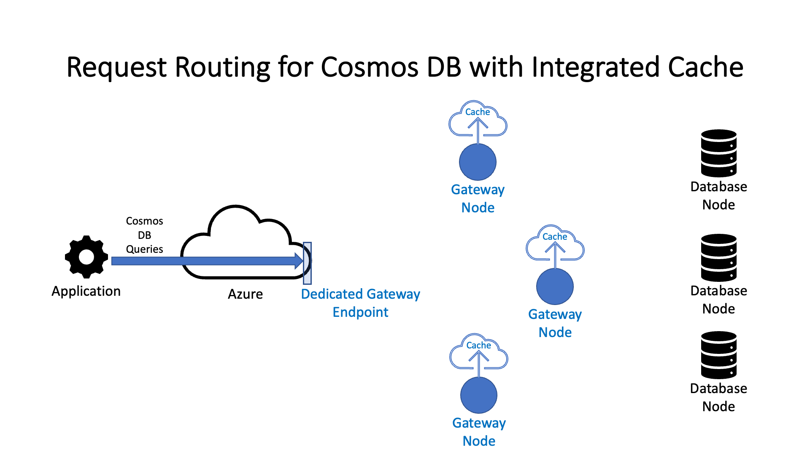

# Exploring Azure Cosmos with Integrated Cache

**Author:** Laura Lund

## Introduction

Have you ever had a use case in which an application receives a high volume of repeated requests against a rarely-changing data set? Caching is the obvious choice to prevent your database from being slammed by too many requests at once, but adding an external cache such as [Azure Redis](https://azure.microsoft.com/en-us/products/cache/) means creating and maintaining an additional dependency. What if you could benefit from caching without having to directly manage your cache?

I recently had the opportunity to build a project using Azure Cosmos DB with integrated cache. My team worked on a customer engagement for a use case that involved heavy reads, low writes, and repeated queries. We used Azure Cosmos DB as our backing datastore, so we decided to try out this new integrated cache feature.

## What is Azure Cosmos DB with integrated cache?

The [Azure Cosmos DB integrated cache](https://learn.microsoft.com/en-us/azure/cosmos-db/integrated-cache) is essentially a turn-key cache that is managed for you. Currently it is only available for the NoSQL API. With the integrated cache you don’t need to set up any additional caching resources or dependencies and your code can simply interact with Cosmos DB without having to explicitly manage the cache.

When you create your Azure Cosmos DB account and enable the [dedicated gateway](https://learn.microsoft.com/en-us/azure/cosmos-db/dedicated-gateway), the integrated cache is configured automatically. As part of the process to [provision the dedicated gateway](https://learn.microsoft.com/en-us/azure/cosmos-db/how-to-configure-integrated-cache?tabs=dotnet), you select the number of gateway nodes you’d like to create. One node is sufficient for development purposes, but for use in production it is recommended to have a minimum of three. The [cost for the dedicated gateway](https://azure.microsoft.com/en-in/pricing/details/cosmos-db/autoscale-provisioned/) is calculated hourly and is determined by the number of nodes and the region selected. Since queries that hit the integrated cache incur no request unit (RU) charges, the overall cost of the database usage will be primarily driven by this hourly charge.

## When is Azure Cosmos DB with Integrated Cache a good fit?

Because the integrated cache is managed for you, it does not give you explicit controls over its operations the way a stand-alone cache would. Therefore it is best suited for applications that:

* Are read-heavy
* Have data that changes infrequently
* Need low latency
* Have repeated queries that benefit from caching
* Tolerate eventual or [session consistency](https://learn.microsoft.com/en-us/azure/cosmos-db/integrated-cache#session-consistency)
* Can operate without the need for an explicit cache refresh

## Architecture of Azure Cosmos DB with Integrated Cache

When a request is sent to Cosmos Db via the dedicated gateway in dedicated gateway mode, the request hits a dedicated gateway node. It is then directed by that node to a backend node to retrieve data. If the cache on the dedicated gateway node does not have the requested data, the data is retrieved from the database (backend node) and the data is cached on the dedicated gateway node before it is returned to the caller. Request unit charges are incurred each time there is a cache miss.

Each dedicated gateway node [maintains its own cache](https://learn.microsoft.com/en-us/azure/cosmos-db/dedicated-gateway). This means you can potentially get back different data depending on which node the request is routed through (see the [docs](https://learn.microsoft.com/en-us/azure/cosmos-db/integrated-cache) and the animation below). The backing data in the database is replicated as usual across all the backend nodes, but caches are not replicated across dedicated gateway nodes. Calls are routed to dedicated gateway nodes randomly, so it is possible to have a cache miss even if the data is cached on another dedicated gateway node.

Cosmos DB integrated cache has an item cache and a query cache:

* The [item cache](https://learn.microsoft.com/en-us/azure/cosmos-db/integrated-cache#item-cache) services point reads where the key is a composite of the item id and partition key and the value is the data in the associated document. The item cache works like write-through cache, which means that the data in the cache is updated at the time it is written.
* The [query cache](https://learn.microsoft.com/en-us/azure/cosmos-db/integrated-cache#query-cache) services queries. For example, a query with a WHERE clause will be cached in the query cache even if it returns a single value. The key for an item in the query cache is based on the query text and the value is the result of that query. Even if a particular document has been cached previously as part of the result for another query, it will be cached again if a given query varies from the previous one. For example, a request that returns documents [1..40] will be cached as one query result and a request that returns documents [2..41] will be cached as a distinct query result. Changes to the backing data do not affect cached values in the query cache.

## Cache Refresh

Cosmos DB with integrated cache handles cache refresh differently from other caching technologies. At this time there is no explicit cache invalidation, but that may be included in a future release. A workaround for if you need to invalidate all cached data on all dedicated gateway nodes is to deprovision and reprovision the dedicated gateway.

As a cache on a given dedicated gateway node fills up with data, it evicts the least-recently accessed values. The item cache is automatically "refreshed" when an item is newly created, updated, or deleted. That is not true for values in the query cache.

The primary mechanism to trigger a query cache refresh is via the `MaxIntegratedCacheStaleness` value that is passed in when an application requests data from Cosmos DB. The calling application essentially tells the dedicated gateway what its tolerance is for stale data. That tolerance may be mere minutes to several days depending on the application’s use cases for the data. When the `MaxIntegratedCacheStaleness` value exceeds the amount of time that has passed since a query result was cached, the query is run against the database again and the updated result is stored in the cache on that dedicated gateway node. If an application queries Cosmos with a `MaxIntegratedCacheStaleness` of 0, it will always get back data from the database and the cache on that dedicated gateway node will be refreshed to store the new query results. The caches on any other dedicated gateway nodes will not be refreshed until a request that “expires” the cached values is routed to that node or it is evicted according to the Least Recently Used (LRU) eviction policy.

Be aware that queries that return no results are cached. This is an edge case in which an application queries data that does not yet exist, the data is then inserted into the database, and the same query is run again. We encountered this case during testing for our project. As a result we decided to skip the cache for certain types of queries in which the backing data changes more frequently. To always hit the database, you can connect to Cosmos DB via [direct mode](https://learn.microsoft.com/en-us/azure/cosmos-db/nosql/sdk-connection-modes) even with an account that has a dedicated gateway. I built a [sandbox project](/README.md) that [explores this edge case](/docs/CacheBehaviorInvestigation.md).

## Comsos DB with Integrated Cache Request Routing and Cache Refresh

Below is an animation of what happens when a request is sent to the dedicated gateway endpoint.

* If the data requested is not in the cache, the request is routed to a backend database node. The data is retrieved and then cached on the dedicated gateway node prior to being returned to the caller.
* If the data is in the cache and the age of the cached data is within the `MaxIntegratedCacheStaleness` value sent with the request, no call is sent to a backend database node. The cached data is returned.
* If the data is in the cache but the age of the cached data *exceeds* the `MaxIntegratedCacheStalenss` value sent with the request, the data is retrieved from a backend database node, cached in the database, and then returned.



## Code Examples

You can download and walk through the code for my [working sandbox project](../src/) that uses Azure Cosmos DB with integrated cache. Start with the [README](../README.md) to understand how to set up for local development.

### Configure CosmosClient to Use Dedicated Gateway

To configure a `CosmosClient` to use your dedicated gateway, you will need to supply your dedicated gateway connection string as well as `CosmosClientOptions` that specify the `ConnectionMode` and `ConsistencyLevel` for the client to use. A complete example is [here](../src/Repositories/CosmosDbRepository.cs).

```C#
    var dedicatedConnectionString = "AccountEndpoint=https://<cosmos-db-account-name>.sqlx.cosmos.azure.com/;AccountKey=<cosmos-db-account-key>;";
    var dedicatedGatewayCosmosClient = new CosmosClient(dedicatedConnectionString,
    new CosmosClientOptions()
    {
        ConnectionMode = ConnectionMode.Gateway,
        ConsistencyLevel = ConsistencyLevel.Eventual
    });
```

### Hit the Integrated Query Cache

To build a query that hits the query cache, use the `GetItemLinqQueryable` method on your `CosmosContainer` object. In your `QueryRequestOptions` add the value you wish to use for `MaxIntegratedCacheStaleness` and set your `ConsistencyLevel`. A complete example is [here](../src/Repositories/CosmosDbRepository.cs).

```C#
    var sortedRefIds = refIds.OrderBy(id => id).ToList(); // Always sending a request in a specific order will maximize your chances of a cache hit

    IQueryable<TestItem> queryable = containerWithDedicatedConnection.GetItemLinqQueryable<TestItem>(
            requestOptions: new QueryRequestOptions
            {
                DedicatedGatewayRequestOptions = new DedicatedGatewayRequestOptions()
                {
                    MaxIntegratedCacheStaleness = TimeSpan.FromHours(cacheStaleness)
                },
                ConsistencyLevel = ConsistencyLevel.Eventual
            }
        );

    queryable = queryable.Where(e => sortedRefIds.Contains(e.RefId));

    using (var linqFeed = queryable.ToFeedIterator())
    {
        while (linqFeed.HasMoreResults)
        {
            var feedResponse = await linqFeed.ReadNextAsync();

            result.RequestUnits = feedResponse.RequestCharge; // When this has a value of 0, that means you've successfully hit the cache

            foreach (var item in feedResponse)
            {
                testItems.Add(item);
            }
        }
    }
```

### Hit the Item Cache

To read from the item cache, send a `ReadItemAsync` request along with `ItemRequestOptions` that point the request to use the dedicated gateway. A complete example is [here](/src/Repositories/CosmosDbRepository.cs)

```C#
    ItemResponse<TestItem> response = await containerWithDedicatedConnection.ReadItemAsync<TestItem>(id, new PartitionKey(partitionKey), 
        new ItemRequestOptions() 
        {
            DedicatedGatewayRequestOptions = new DedicatedGatewayRequestOptions()
            {
                MaxIntegratedCacheStaleness = TimeSpan.FromHours(cacheStaleness)
            },
            ConsistencyLevel = ConsistencyLevel.Eventual
        });

    var testItemQueryResult = new TestItemQueryResult();

    testItemQueryResult.TestItems.Add(response.Resource); // the document
    testItemQueryResult.RequestUnits = response.RequestCharge; // the request unit charge

    return testItemQueryResult;
```

The document will be returned in the `Resource` property on the `ItemResponse` object and the number of Request Units consumed will be returned on the `RequestCharge` property.

## Conclusion

The simplification of application architecture is what I like the most about Azure Cosmos DB with integrated cache. It's convenient to be able to simply write Cosmos queries and know that cache hits and misses are handled automatically. For usage patterns involving a high volume of *repeated* requests, Azure Cosmos DB with integrated cache can serve thousands of requests per second without a corresponding high Request Unit charge. The dedicated gateway costs can be predicted in advance, which can result in overall lower Cosmos DB charges as compared to a Azure Cosmos DB *without* an integrated cache. I look forward to additional features the Azure Cosmos DB product team may develop to make this an even more robust product.
